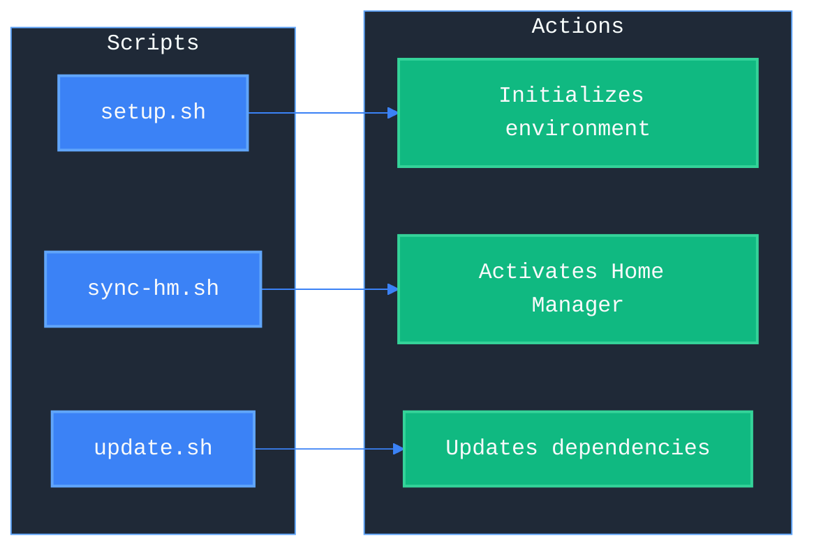
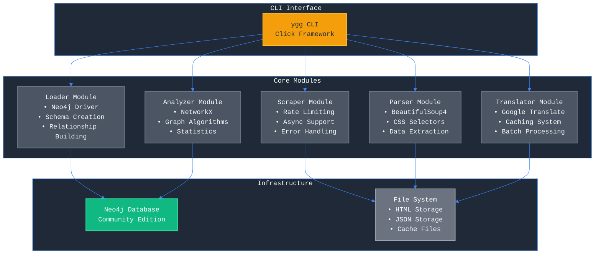
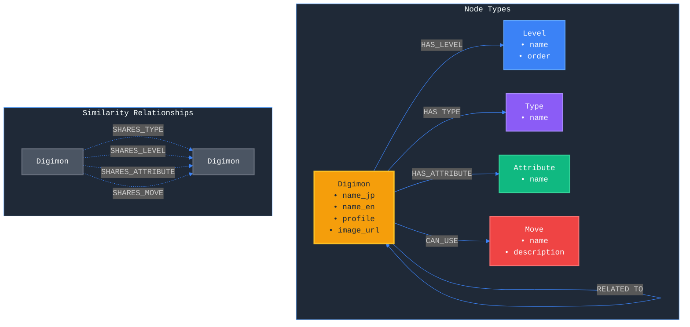
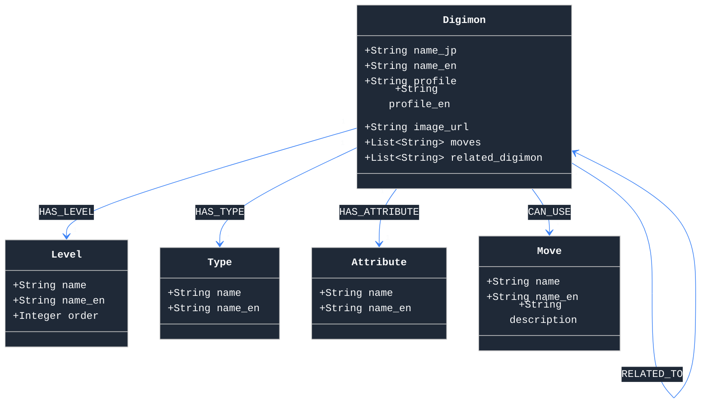

# Project Yggdrasil - Digimon Knowledge Graph

## Overview
This project builds a comprehensive knowledge graph from digimon.net/reference to analyze relationships between Digimon based on their characteristics, evolution patterns, and shared attributes. The data is scraped from the Japanese reference site, translated to English, and loaded into a Neo4j graph database for network analysis.

## Current Status
- **Phase**: Full pipeline completed with data loaded in Neo4j
- **Environment**: Development environment configured with Nix/Poetry/pip options
- **Database**: Neo4j running with complete Digimon graph data
- **Progress**:
  ✅ HTML structure investigation complete
  ✅ Found 1,249 Digimon URLs via API
  ✅ Successfully scraped all 1,249 Digimon
  ✅ Parser extracted all data correctly
  ✅ Translation pipeline completed with caching
  ✅ Neo4j loader populated complete graph
  ✅ Full dataset loaded (1,258 Digimon in database)
  ✅ Analysis notebooks updated with organized folder structure

## Key Commands

### Initial Setup
```bash
# Enter development environment
nix develop

# Install CLI
pip install -e .

# First time setup
ygg start  # Start Neo4j
ygg run    # Run full pipeline
```

### Data Pipeline
```bash
# Check current status
ygg status

# Run data pipeline (~2-3 hours total, no analysis)
ygg run

# Or run individual steps:
ygg scrape       # ~40-50 minutes for all 1,249 Digimon
ygg parse        # ~5 minutes
ygg translate    # ~60-90 minutes
ygg load         # ~5 minutes
ygg analyze      # Run analysis separately
```

### Quick Test Commands
```bash
# Test scraper with small batch (10 Digimon)
python test_scraper_small.py

# Parse scraped HTML files
python -m src.parser.main --test
```

### Development Commands
```bash
# Testing
pytest tests/

# Code quality
black src/
ruff check src/
mypy src/

# Neo4j operations
ygg start        # Start Neo4j
ygg stop         # Stop Neo4j
ygg logs         # View Neo4j logs
ygg db-status    # Check Neo4j status

# Data management
ygg prune        # Clean up data files
ygg prune --include-neo4j  # Clean up data files AND Neo4j database
```

## Architecture

### Overall Architecture
The system follows a modular pipeline architecture where each component has a specific responsibility in the data processing flow.

```
┌─────────────────┐     ┌─────────────────┐     ┌─────────────────┐
│                 │     │                 │     │                 │
│  digimon.net    │────▶│   Scraper       │────▶│  Raw HTML       │
│  (Data Source)  │     │   (Async)       │     │  Storage        │
│                 │     │                 │     │                 │
└─────────────────┘     └─────────────────┘     └─────────────────┘
                                                          │
                                                          ▼
┌─────────────────┐     ┌─────────────────┐     ┌─────────────────┐
│                 │     │                 │     │                 │
│  Translation    │◀────│   Parser        │◀────│  Structured     │
│  (Google API)   │     │   (BS4)         │     │  JSON Data      │
│                 │     │                 │     │                 │
└─────────────────┘     └─────────────────┘     └─────────────────┘
                                │
                                ▼
┌─────────────────┐     ┌─────────────────┐     ┌─────────────────┐
│                 │     │                 │     │                 │
│  Neo4j Graph    │◀────│   Loader        │     │   Analysis      │
│  Database       │     │   (py2neo)      │────▶│   (NetworkX)    │
│                 │     │                 │     │                 │
└─────────────────┘     └─────────────────┘     └─────────────────┘
```

### Scripts Overview
This diagram shows the main scripts and their relationships in the project.



### Data Flow Diagram
This diagram shows how data flows through the system from source to analysis, including all intermediate storage layers.

```mermaid
%%{init: {'theme':'dark', 'themeVariables': { 'primaryColor':'#1f2937', 'primaryTextColor':'#f9fafb', 'primaryBorderColor':'#60a5fa', 'lineColor':'#3b82f6', 'secondaryColor':'#059669', 'tertiaryColor':'#374151', 'background':'#111827', 'mainBkg':'#1f2937', 'secondBkg':'#374151', 'tertiaryBkg':'#4b5563', 'primaryBorderColor':'#60a5fa', 'secondaryBorderColor':'#10b981', 'tertiaryBorderColor':'#6366f1', 'clusterBkg':'#1f2937', 'clusterBorder':'#60a5fa', 'fontFamily':'monospace'}}}%%
flowchart LR
    subgraph DS["Data Sources"]
        A[digimon.net/reference]
    end
    
    subgraph DP["Data Pipeline"]
        B[Scraper<br/>BeautifulSoup4]
        C[Parser<br/>HTML → JSON]
        D[Translator<br/>JP → EN]
        E[Loader<br/>JSON → Neo4j]
    end
    
    subgraph ST["Storage"]
        F[(Raw HTML<br/>Files)]
        G[(Parsed JSON<br/>Files)]
        H[(Translated<br/>JSON)]
        I[(Neo4j<br/>Graph DB)]
    end
    
    subgraph AN["Analysis"]
        J[NetworkX<br/>Analyzer]
        K[Notebooks<br/>& Visualizations]
    end
    
    A -->|HTTP Requests| B
    B -->|Save| F
    F -->|Read| C
    C -->|Save| G
    G -->|Read| D
    D -->|Cache| H
    H -->|Read| E
    E -->|Import| I
    I -->|Query| J
    J -->|Generate| K
    
    classDef source fill:#8b5cf6,stroke:#a78bfa,stroke-width:2px,color:#f9fafb
    classDef storage fill:#10b981,stroke:#34d399,stroke-width:2px,color:#f9fafb
    classDef output fill:#3b82f6,stroke:#60a5fa,stroke-width:2px,color:#f9fafb
    classDef pipeline fill:#f59e0b,stroke:#fbbf24,stroke-width:2px,color:#1f2937
    classDef files fill:#6b7280,stroke:#9ca3af,stroke-width:2px,color:#f9fafb
    classDef analysis fill:#ef4444,stroke:#f87171,stroke-width:2px,color:#f9fafb
    
    class A source
    class I storage
    class K output
    class B,C,D,E pipeline
    class F,G,H files
    class J analysis
```



### System Architecture
This diagram illustrates the modular architecture showing how the CLI interface connects to core modules and infrastructure.



### Key Technologies
- **Scraping**: BeautifulSoup4, requests, asyncio
- **Translation**: googletrans (with caching)
- **Database**: Neo4j Community Edition
- **Analysis**: NetworkX, pandas, matplotlib
- **CLI**: Click framework
- **Data Processing**: JSON, pandas

## Important Configuration

### Environment Variables (.env)
```env
NEO4J_URI=bolt://localhost:7687
NEO4J_USER=neo4j
NEO4J_PASSWORD=digimon123
SCRAPE_DELAY=1.0
```

### Scraping Settings (config.yaml)
- Base URL: https://digimon.net/reference/
- Rate limit: 1 second delay between requests
- Concurrent requests: 3
- Respects robots.txt

## Project Goals
1. Create comprehensive Digimon knowledge graph
2. Analyze evolution patterns and relationships
3. Discover insights through network analysis
4. Publish findings in technical article

## Implementation Details

### Discovered Selectors
From the HTML investigation, the key selectors are:
- **Japanese name**: `.c-titleSet__main`
- **English name**: `.c-titleSet__sub`
- **Level/Type/Attribute**: `dl` (definition lists)
- **Main image**: `.c-thumb img`
- **Profile text**: In structured sections
- **Special moves**: Extracted from profile text
- **Related Digimon**: Links in page content

### Data Extracted
Each Digimon page provides:
- Japanese and English names
- Level (究極体, 完全体, etc.)
- Type (マシーン型, サイボーグ型, etc.)
- Attribute (ワクチン, ウィルス, データ)
- Full profile description (Japanese)
- Special move names
- Related Digimon with links
- Main image URL

## Current Implementation Status
- ✅ Project structure created
- ✅ Configuration system ready
- ✅ Logging and utilities implemented
- ✅ Scraping framework operational
- ✅ HTML structure investigation complete
- ✅ Data extraction parser working
- ✅ Found all 1,249 Digimon URLs
- ✅ Full dataset collection completed
- ✅ Translation pipeline with caching completed
- ✅ Neo4j schema and loader populated
- ✅ Graph database contains 1,258 Digimon nodes
- ✅ Analysis notebooks ready with organized output structure

## Translation Details
The translation pipeline includes:
- **Google Translate API** via googletrans library
- **Intelligent caching** to avoid repeated API calls
- **Static translations** for common terms (levels, attributes)
- **Rate limiting** to respect API limits
- **Batch processing** for efficiency

Translations provided:
- Level names (究極体 → Mega, 完全体 → Ultimate, etc.)
- Types (マシーン型 → Machine Type)
- Attributes (ワクチン → Vaccine, ウィルス → Virus, データ → Data)
- Full profile descriptions
- Special move names

## Neo4j Graph Schema

### Graph Schema Diagram



### Node Properties



### Relationship Details
- **HAS_LEVEL**: Links Digimon to their evolution level
- **HAS_TYPE**: Links Digimon to their types (can have multiple)
- **HAS_ATTRIBUTE**: Links Digimon to their attribute (Vaccine/Virus/Data/Free)
- **CAN_USE**: Links Digimon to their special moves
- **RELATED_TO**: Direct relationships between Digimon
- **SHARES_TYPE**: Auto-generated relationships for Digimon with same type
- **SHARES_LEVEL**: Auto-generated relationships for Digimon at same level
- **SHARES_ATTRIBUTE**: Auto-generated relationships for Digimon with same attribute
- **SHARES_MOVE**: Auto-generated relationships for Digimon sharing moves

## Next Actions
1. Run analysis notebooks to generate insights
2. Review and interpret analysis results
3. Create summary visualizations
4. Document key findings
5. Prepare technical article with insights

## Full Pipeline Command Sequence
```bash
# Option 1: Run data pipeline (without analysis)
ygg start  # Start Neo4j if not running
ygg run    # Run data pipeline

# Option 2: Run steps individually
ygg start        # Start Neo4j
ygg scrape       # Scrape all Digimon (~40-50 minutes)
ygg parse        # Parse all HTML files
ygg translate    # Translate all data
ygg load         # Load into Neo4j
ygg analyze      # Run analysis (separate command)
```

## Notes for Claude
- This is a data analysis project focused on creating a knowledge graph
- The scraper is designed to be respectful (rate limiting, robots.txt)
- Translation caching is important to avoid API limits
- File naming needs special handling for Japanese characters
- The project uses defensive security practices only

## Pipeline Validation
Run `python check_status.py` to see the current state of the pipeline and what steps are needed next.

## Estimated Time for Full Pipeline
1. **Scraping**: ~40-50 minutes (1,249 pages with 1s delay)
2. **Parsing**: ~5 minutes
3. **Translation**: ~60-90 minutes (with caching and rate limiting)
4. **Neo4j Loading**: ~5 minutes
5. **Total**: ~2-3 hours

## Success Metrics
- All 1,249 Digimon scraped and parsed
- 100% translation coverage with caching
- Complete graph with all relationships
- Analysis reveals network patterns and insights