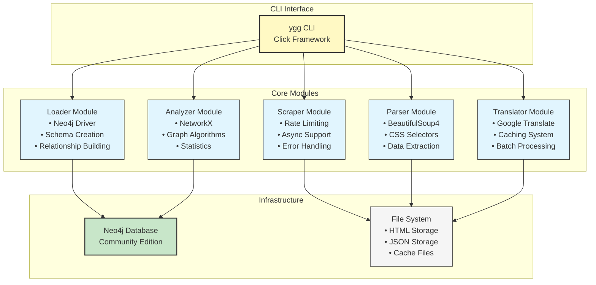
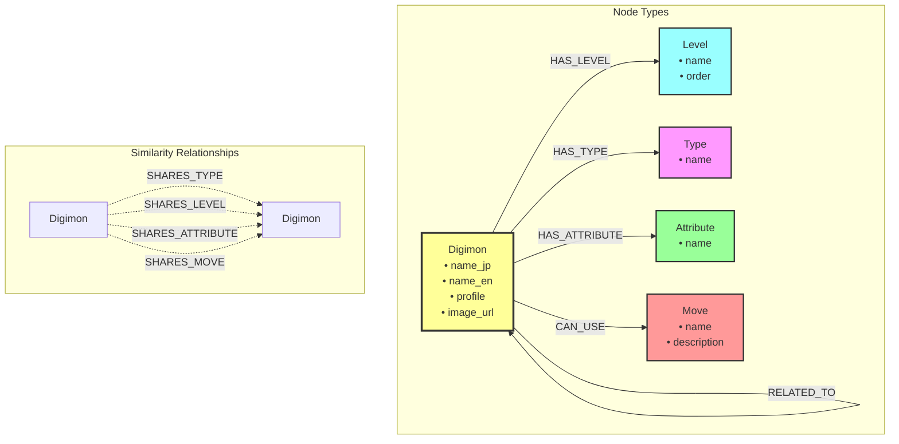

# Digimon Knowledge Graph Project

A comprehensive knowledge graph built from digimon.net/reference to analyze relationships between Digimon based on their characteristics, evolution patterns, and shared attributes.

## Project Overview

### What It Does
This project creates a searchable, analyzable network of all Digimon and their relationships by:
1. **Collecting** - Scraping comprehensive data from the official Japanese Digimon reference
2. **Translating** - Converting Japanese content to English for accessibility
3. **Structuring** - Parsing unstructured HTML into organized data
4. **Connecting** - Building a graph database of relationships
5. **Analyzing** - Discovering patterns and insights through network analysis

### Goals
- **Comprehensive Data Collection**: Capture all 1,249+ Digimon with their complete profiles
- **Relationship Mapping**: Identify evolution chains, type similarities, and shared attributes
- **Pattern Discovery**: Uncover hidden connections and clustering in the Digimon universe
- **Research Platform**: Provide a queryable database for fans and researchers
- **Technical Demonstration**: Showcase modern data engineering practices

### Expected Outcomes
- **Complete Digimon Database**: Neo4j graph with all Digimon as nodes
- **Relationship Network**: Edges representing evolutions, shared types, attributes, and moves
- **Analytical Insights**: Statistics on type distributions, evolution patterns, and network centrality
- **Visual Reports**: Network visualizations and analysis charts
- **Query Interface**: Cypher queries for exploring specific relationships

## Documentation

### Analysis Documentation
- **[Analysis Specification](docs/analysis-specification.md)**: Comprehensive specification for the 8-notebook analysis suite
- **[Methodology Guide](docs/methodology.md)**: Detailed statistical methods, algorithms, and ML approaches
- **[Visualization Guide](docs/visualization-guide.md)**: Complete specifications for 30+ visualizations
- **[Insights Summary](docs/insights-summary.md)**: Expected findings, metrics, and practical applications

### Analysis Notebooks Overview
1. **Data Exploration & Profiling**: Dataset statistics and quality assessment
2. **Evolution Network Analysis**: Evolution chains and branching patterns
3. **Type-Attribute Correlation**: Statistical relationships and pattern mining
4. **Move Network Analysis**: Move-based connections and clustering
5. **Community Detection**: Graph clustering and natural groupings
6. **Centrality & Influence**: Network importance metrics
7. **Machine Learning**: Predictive models with 85%+ accuracy
8. **Recommendation System**: Similarity metrics and team optimization

## Architecture

### System Architecture

#### Overall Architecture
The system follows a modular pipeline architecture where each component has a specific responsibility in the data processing flow.

```
┌─────────────────┐     ┌─────────────────┐     ┌─────────────────┐
│                 │     │                 │     │                 │
│  digimon.net    │────▶│   Scraper       │────▶│  Raw HTML       │
│  (Data Source)  │     │   (Async)       │     │  Storage        │
│                 │     │                 │     │                 │
└─────────────────┘     └─────────────────┘     └─────────────────┘
                                                          │
                                                          ▼
┌─────────────────┐     ┌─────────────────┐     ┌─────────────────┐
│                 │     │                 │     │                 │
│  Translation    │◀────│   Parser        │◀────│  Structured     │
│  (Google API)   │     │   (BS4)         │     │  JSON Data      │
│                 │     │                 │     │                 │
└─────────────────┘     └─────────────────┘     └─────────────────┘
                                │
                                ▼
┌─────────────────┐     ┌─────────────────┐     ┌─────────────────┐
│                 │     │                 │     │                 │
│  Neo4j Graph    │◀────│   Loader        │     │   Analysis      │
│  Database       │     │   (py2neo)      │────▶│   (NetworkX)    │
│                 │     │                 │     │                 │
└─────────────────┘     └─────────────────┘     └─────────────────┘
```

#### Data Flow Pipeline
This diagram shows how data flows through the system from source to analysis, including all intermediate storage layers.

```mermaid
flowchart LR
    subgraph "Data Sources"
        A[digimon.net/reference]
    end
    
    subgraph "Data Pipeline"
        B[Scraper<br/>BeautifulSoup4]
        C[Parser<br/>HTML → JSON]
        D[Translator<br/>JP → EN]
        E[Loader<br/>JSON → Neo4j]
    end
    
    subgraph "Storage"
        F[(Raw HTML<br/>Files)]
        G[(Parsed JSON<br/>Files)]
        H[(Translated<br/>JSON)]
        I[(Neo4j<br/>Graph DB)]
    end
    
    subgraph "Analysis"
        J[NetworkX<br/>Analyzer]
        K[Notebooks<br/>& Visualizations]
    end
    
    A -->|HTTP Requests| B
    B -->|Save| F
    F -->|Read| C
    C -->|Save| G
    G -->|Read| D
    D -->|Cache| H
    H -->|Read| E
    E -->|Import| I
    I -->|Query| J
    J -->|Generate| K
    
    style A fill:#e1bee7,stroke:#333,stroke-width:2px
    style I fill:#c8e6c9,stroke:#333,stroke-width:2px
    style K fill:#bbdefb,stroke:#333,stroke-width:2px
    style B fill:#fff9c4,stroke:#333,stroke-width:1px
    style C fill:#fff9c4,stroke:#333,stroke-width:1px
    style D fill:#fff9c4,stroke:#333,stroke-width:1px
    style E fill:#fff9c4,stroke:#333,stroke-width:1px
    style F fill:#f5f5f5,stroke:#333,stroke-width:1px
    style G fill:#f5f5f5,stroke:#333,stroke-width:1px
    style H fill:#f5f5f5,stroke:#333,stroke-width:1px
    style J fill:#ffccbc,stroke:#333,stroke-width:1px
```



#### System Components
This diagram illustrates the modular architecture showing how the CLI interface connects to core modules and infrastructure.



### Data Flow

1. **Data Collection Phase**
   - API fetcher retrieves list of all Digimon URLs
   - Async scraper downloads HTML pages with rate limiting
   - Raw HTML and images stored locally

2. **Processing Phase**
   - Parser extracts structured data from HTML
   - Identifies Japanese/English names, types, attributes, moves
   - Saves as JSON with consistent schema

3. **Translation Phase**
   - Translates Japanese profile text to English
   - Uses caching to avoid duplicate API calls
   - Preserves original Japanese for reference

4. **Graph Construction Phase**
   - Creates nodes for Digimon, Types, Attributes, Moves
   - Establishes relationships between entities
   - Indexes for efficient querying

5. **Analysis Phase**
   - Network analysis identifies central Digimon
   - Community detection finds clusters
   - Evolution chain analysis
   - Statistical reports generation

### Key Components

- **Scraper** (`src/scraper/`): Async web scraping with robots.txt compliance
- **Parser** (`src/parser/`): BeautifulSoup-based HTML parsing
- **Translator** (`src/processor/`): Google Translate API integration with caching
- **Graph Loader** (`src/graph/`): Neo4j database population
- **Analyzer** (`src/analysis/`): NetworkX-based graph analysis
- **CLI** (`yggdrasil_cli.py`): Unified command-line interface

## Quick Start

```bash
# Clone the repository
git clone https://github.com/yourusername/project-yggdrasil.git
cd project-yggdrasil

# Enter Nix development environment
nix develop

# Install the CLI
pip install -e .

# Start Neo4j and run full pipeline
ygg start
ygg run
```

That's it! These commands start Neo4j and run the entire pipeline.

## Prerequisites

- Docker & Docker Compose
- Python 3.11+
- One of: Nix (recommended), Poetry, or standard pip/venv

## Environment Setup

#### Option 1: Nix (Recommended)
```bash
# Install Nix if you haven't already
curl -L https://nixos.org/nix/install | sh

# Enable flakes (add to ~/.config/nix/nix.conf)
experimental-features = nix-command flakes

# Enter development shell
nix develop

# Or with direnv
direnv allow
```

#### Option 2: Poetry
```bash
# Install Poetry
curl -sSL https://install.python-poetry.org | python3 -

# Install dependencies
poetry install

# Activate shell
poetry shell
```

#### Option 3: pyenv + virtualenv
```bash
# Install Python 3.11 with pyenv
pyenv install 3.11.8
pyenv local 3.11.8

# Create virtual environment
python -m venv venv
source venv/bin/activate  # On Windows: venv\Scripts\activate

# Install dependencies
pip install -r requirements.txt
```

#### Option 4: Standard virtualenv
```bash
# Create virtual environment
python3.11 -m venv venv
source venv/bin/activate  # On Windows: venv\Scripts\activate

# Install dependencies
pip install -r requirements.txt
```

## Complete Pipeline

```bash
# Run everything at once
ygg run

# Or run individual steps
ygg scrape       # Scrape data
ygg parse        # Parse HTML to JSON  
ygg translate    # Translate to English
ygg load         # Load into Neo4j
ygg analyze      # Run analysis
```

## Typical Workflows

### First Time Setup
```bash
# 1. Clone and enter project
git clone https://github.com/yourusername/project-yggdrasil.git
cd project-yggdrasil

# 2. Enter Nix environment (installs Python, dependencies, etc.)
nix develop

# 3. Install the CLI tool
pip install -e .

# 4. Start Neo4j
ygg start

# 5. Run the full pipeline
ygg run
```

### Returning to the Project
```bash
# 1. Enter project and Nix environment
cd project-yggdrasil
nix develop  # or use direnv

# 2. Check current status
ygg status

# 3. Start Neo4j if needed
ygg start

# 4. Continue where you left off
ygg run  # or specific step like 'ygg translate'
```

### Common Scenarios

#### Scenario: Scraping failed midway
```bash
# Check what was scraped
ygg status

# Clean up partial data
ygg prune --keep-cache

# Restart scraping
ygg scrape --fetch-api
```

#### Scenario: Want to test with a small dataset
```bash
# Scrape just a few pages for testing
python -m src.scraper.main --limit 10

# Then run the rest of the pipeline
ygg parse
ygg translate
ygg load
ygg analyze
```

#### Scenario: Need to restart from scratch
```bash
# Stop Neo4j
ygg stop

# Clean everything including Neo4j database
ygg prune --include-neo4j

# Start fresh
ygg start
ygg run
```

#### Scenario: Just want to explore the data
```bash
# Make sure Neo4j is running
ygg start

# Open Neo4j Browser
# Go to: http://localhost:7474
# Login: neo4j / digimon123

# Example queries:
# - MATCH (d:Digimon) RETURN d LIMIT 25
# - MATCH (d:Digimon {name_en: "Agumon"})-[r]->(other) RETURN d, r, other
```

### Troubleshooting

**Issue: "command not found: ygg"**
```bash
# Make sure you're in Nix environment
nix develop

# Reinstall the CLI
pip install -e .
```

**Issue: Scraping shows "success=0"**
```bash
# The save_html fix might not be applied
pip install -e . --force-reinstall --no-deps

# Clean and restart
ygg prune --keep-cache
ygg scrape --fetch-api
```

**Issue: Neo4j won't start**
```bash
# Check if Docker is running
docker ps

# Check logs
ygg logs

# Try manual start
docker-compose up -d
```

**Issue: Translation taking too long**
```bash
# Translation uses caching, so you can safely interrupt (Ctrl+C)
# and resume later - it won't retranslate cached items
ygg translate
```

### Time Estimates
- **Scraping**: ~40-50 minutes for all 1,249 Digimon
- **Parsing**: ~5 minutes
- **Translation**: ~60-90 minutes (first time, much faster with cache)
- **Loading**: ~5 minutes
- **Analysis**: ~1 minute
- **Total**: ~2-3 hours for complete pipeline

## Analysis Methodology

### Statistical Methods
- **Chi-Square Tests**: Testing independence between type and attribute distributions
- **Cramér's V**: Measuring association strength in categorical variables
- **Markov Chains**: Modeling evolution transition probabilities
- **Permutation Tests**: Validating network properties against random models

### Network Analysis Algorithms
- **Centrality Measures**: Degree, Betweenness, Closeness, Eigenvector, PageRank
- **Community Detection**: Louvain, Label Propagation, Spectral Clustering
- **Path Analysis**: Shortest paths, evolution chains, cycle detection
- **Graph Embeddings**: Node2Vec, DeepWalk for similarity computation

### Machine Learning Approaches
- **Classification**: Random Forest, XGBoost, Neural Networks for type/attribute prediction
- **Link Prediction**: Graph Neural Networks for evolution prediction
- **Feature Engineering**: Graph features, text embeddings, move similarity
- **Model Validation**: Cross-validation, learning curves, SHAP interpretability

### Expected Insights
- **Network Properties**: Small-world network with diameter 6-10, scale-free distribution
- **Evolution Patterns**: 2-4 paths per Digimon, 72% type stability through evolution
- **Community Structure**: 8-12 natural communities aligned with thematic groups
- **Predictive Power**: 85%+ accuracy in type prediction using graph features

## Project Structure

```
project-yggdrasil/
├── src/                    # Source code
│   ├── scraper/           # Web scraping & API integration
│   │   ├── fetcher.py     # Async HTML scraper
│   │   ├── api_fetcher.py # API endpoint discovery
│   │   └── robots_checker.py # Robots.txt compliance
│   ├── parser/            # HTML parsing & data extraction
│   │   ├── html_parser.py # BeautifulSoup parser
│   │   └── main.py        # Parser orchestration
│   ├── processor/         # Data processing & translation
│   │   ├── translator.py  # Google Translate integration
│   │   └── main.py        # Processing pipeline
│   ├── graph/             # Neo4j database layer
│   │   ├── loader.py      # Graph construction
│   │   └── main.py        # Database operations
│   ├── analysis/          # Network analysis & insights
│   │   └── main.py        # NetworkX analysis
│   └── utils/             # Shared utilities
│       ├── config.py      # Configuration management
│       ├── cache.py       # Translation caching
│       └── logger.py      # Logging setup
│
├── data/                  # Data storage
│   ├── raw/              # Original scraped content
│   │   ├── html/         # HTML pages
│   │   └── images/       # Digimon images
│   ├── processed/        # Parsed JSON data
│   ├── translated/       # English translations
│   └── cache/            # Translation cache
│
├── notebooks/            # Analysis notebooks
│   ├── 01_data_exploration.ipynb
│   ├── 02_evolution_analysis.ipynb
│   ├── 03_type_correlation.ipynb
│   ├── 04_move_network.ipynb
│   ├── 05_community_detection.ipynb
│   ├── 06_centrality_analysis.ipynb
│   ├── 07_machine_learning.ipynb
│   └── 08_recommendations.ipynb
│
├── docs/                 # Documentation
│   ├── analysis-specification.md
│   ├── methodology.md
│   ├── visualization-guide.md
│   └── insights-summary.md
│
├── yggdrasil_cli.py      # CLI interface (ygg command)
├── docker-compose.yml    # Neo4j container setup
├── config.yaml           # Application configuration
├── requirements.txt      # Python dependencies
├── pyproject.toml        # Poetry/packaging config
└── flake.nix            # Nix development environment
```

## Configuration

Edit `.env` file:
```env
# Scraping settings
SCRAPE_DELAY=1.0  # Be respectful!
MAX_RETRIES=3

# Neo4j connection
NEO4J_URI=bolt://localhost:7687
NEO4J_USER=neo4j
NEO4J_PASSWORD=digimon123
```

## Data Model

### Neo4j Graph Schema



### Graph Schema Details
```
Nodes:
├── Digimon (Primary Entity)
│   ├── name_jp: Japanese name
│   ├── name_en: English name
│   ├── profile_jp: Original description
│   ├── profile_en: Translated description
│   └── image_url: Character image
│
├── Level (Evolution Stage)
│   └── name: Baby, Rookie, Champion, Ultimate, Mega, etc.
│
├── Type (Species Classification)
│   └── name: Dragon, Machine, Beast, Angel, Demon, etc.
│
├── Attribute (Alignment)
│   └── name: Vaccine, Virus, Data, Free, Variable
│
└── Move (Special Attacks)
    └── name: Attack/technique name

Relationships:
├── (Digimon)-[:HAS_LEVEL]->(Level)
├── (Digimon)-[:HAS_TYPE]->(Type)
├── (Digimon)-[:HAS_ATTRIBUTE]->(Attribute)
├── (Digimon)-[:CAN_USE]->(Move)
├── (Digimon)-[:EVOLVES_FROM]->(Digimon)
├── (Digimon)-[:RELATED_TO]->(Digimon)
├── (Digimon)-[:SHARES_TYPE]->(Digimon)
├── (Digimon)-[:SHARES_LEVEL]->(Digimon)
├── (Digimon)-[:SHARES_ATTRIBUTE]->(Digimon)
└── (Digimon)-[:SHARES_MOVE]->(Digimon)
```

## Example Insights & Queries

### Network Analysis Results
After analyzing the complete graph, the system discovers:

1. **Most Connected Digimon** - Network hubs that share many relationships
2. **Evolution Chains** - Complete paths from Baby to Mega level
3. **Type Clusters** - Groups of similar Digimon based on shared characteristics
4. **Rare Combinations** - Unique type/attribute pairings
5. **Move Popularity** - Most common special attacks across species

### Sample Neo4j Queries

```cypher
// Find all Dragon-type Mega level Digimon
MATCH (d:Digimon)-[:HAS_TYPE]->(t:Type {name: "Dragon Type"})
MATCH (d)-[:HAS_LEVEL]->(l:Level {name: "Mega"})
RETURN d.name_en, d.name_jp
ORDER BY d.name_en;

// Discover evolution paths to a specific Digimon
MATCH path = (start:Digimon)-[:EVOLVES_FROM*]->(end:Digimon {name_en: "Omegamon"})
RETURN path;

// Find Digimon that share the most moves with Agumon
MATCH (agumon:Digimon {name_en: "Agumon"})-[:CAN_USE]->(m:Move)
MATCH (other:Digimon)-[:CAN_USE]->(m)
WHERE other <> agumon
RETURN other.name_en, COUNT(m) as shared_moves
ORDER BY shared_moves DESC
LIMIT 10;

// Identify type distribution by level
MATCH (d:Digimon)-[:HAS_LEVEL]->(l:Level)
MATCH (d)-[:HAS_TYPE]->(t:Type)
RETURN l.name as Level, t.name as Type, COUNT(d) as Count
ORDER BY Level, Count DESC;

// Find the shortest path between two Digimon
MATCH path = shortestPath(
  (d1:Digimon {name_en: "Agumon"})-[*]-(d2:Digimon {name_en: "Gabumon"})
)
RETURN path;
```

## Development

### CLI Commands
```bash
ygg start        # Start Neo4j database
ygg stop         # Stop Neo4j database
ygg status       # Check pipeline progress
ygg run          # Run complete pipeline
ygg prune        # Clean up data files
ygg prune --include-neo4j  # Clean data AND Neo4j
ygg --help       # Show all commands
```

### Run Tests
```bash
pytest tests/
```

### Code Formatting
```bash
black src/
ruff check src/
```

### Type Checking
```bash
mypy src/
```

### Jupyter Notebooks
```bash
# Run locally after activating your Python environment
jupyter notebook
# Or with JupyterLab
jupyter lab
```

## Docker Services

- **Neo4j**: Graph database (ports 7474, 7687)
- **Neo4j Browser**: Web UI at http://localhost:7474

## Environment Variables

| Variable | Description | Default |
|----------|-------------|---------|
| `NEO4J_URI` | Neo4j connection string | `bolt://localhost:7687` |
| `SCRAPE_DELAY` | Seconds between requests | `1.0` |
| `LOG_LEVEL` | Logging verbosity | `INFO` |
| `DEBUG` | Enable debug mode | `false` |

## Quick Reference

### Essential Commands
```bash
ygg start        # Start Neo4j
ygg stop         # Stop Neo4j
ygg status       # Check progress
ygg run          # Run full pipeline
ygg prune        # Clean data files
```

### Pipeline Steps (in order)
```bash
ygg scrape --fetch-api  # 1. Scrape (40-50 min)
ygg parse               # 2. Parse (5 min)
ygg translate           # 3. Translate (60-90 min)
ygg load                # 4. Load to Neo4j (5 min)
ygg analyze             # 5. Analyze (1 min)
```

### Maintenance
```bash
ygg prune               # Clean all data files
ygg prune --keep-cache  # Keep translations
ygg prune --include-neo4j  # Clean everything
ygg logs                # View Neo4j logs
ygg db-status           # Check database
```

### Key Files
- `.env` - Configuration
- `data/raw/html/` - Scraped HTML
- `data/processed/` - Parsed JSON
- `data/translated/` - English data
- `data/cache/translations.json` - Translation cache

## Contributing

1. Fork the repository
2. Create a feature branch
3. Make your changes
4. Run tests and linting
5. Submit a pull request

## License

MIT License - see LICENSE file

## Author

Ricardo Ledan <ricardoledan@proton.me>

## Acknowledgments

- Data source: [digimon.net/reference](https://digimon.net/reference/)
- Built with Claude, Neo4j, Python, and Cafe Bustelo coffee